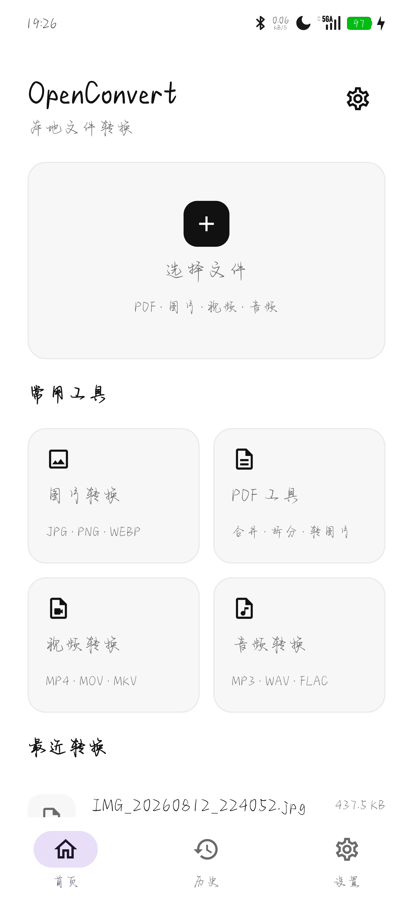
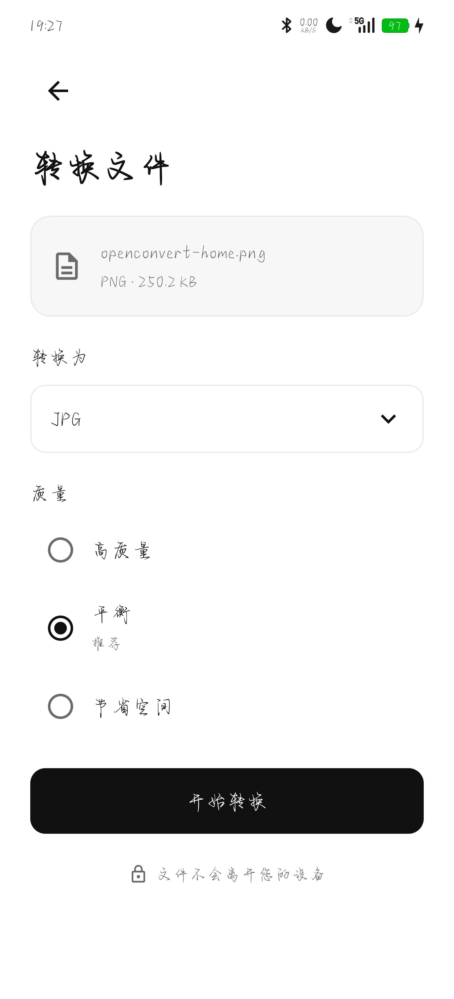
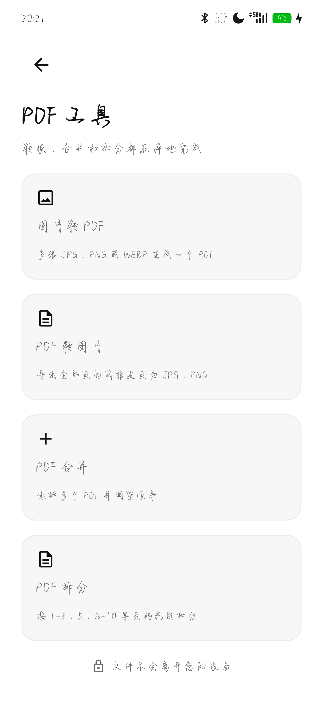
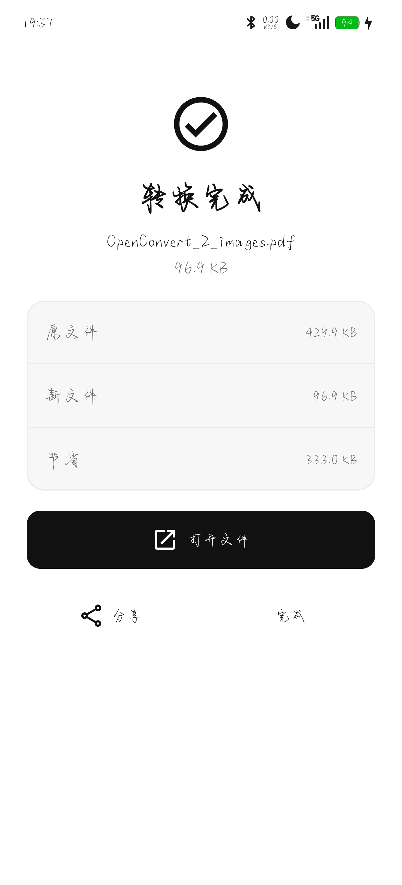

# OpenConvert

Fully offline Android file conversion.

> **Your files never leave your device.**
>
> The app does **not** declare `INTERNET`. No account. No upload. No cloud queue.

[简体中文](README.md) | **English**

<p align="center">
  
  
  
  
</p>

<p align="center">
  <a href="https://github.com/donalaaaaaaa/OpenConvert/releases">Download Release</a>
  ·
  <a href="docs/install.md">Install notes (zh)</a>
  ·
  <a href="docs/known-issues.md">Known issues (zh)</a>
  ·
  <a href="docs/releases/">Changelog</a>
  ·
  <a href="SECURITY.md">Security</a>
  ·
  <a href="CONTRIBUTING.md">Contributing</a>
  ·
  <a href="CODE_OF_CONDUCT.md">Code of Conduct</a>
</p>

---

## Which package

| Edition | What you get | Release APK | Who |
|---|---|---|---|
| **Basic** | Images, audio/video, PDF, archives | See [Releases](https://github.com/donalaaaaaaa/OpenConvert/releases) | Default |
| **Office** | Basic + DOCX/DOC/PPTX/PPT/XLSX/XLS → PDF | Same | Offline Office |

Same `applicationId` and signing. Basic can overlay-upgrade to Office; history, presets, and SAF grants stay. See [install notes](docs/install.md).

---

## What it does

### Images

JPG / PNG / WEBP / AVIF / HEIC / GIF / BMP / TIFF in; JPG / PNG / WEBP out.

- Scale, crop, rotate, flip
- Strip EXIF / GPS / metadata
- Engine: `libvips 8.18.5`, `BitmapFactory` fallback

### Audio / video

Video: MP4, MOV, MKV, WEBM, AVI  
Audio: MP3, AAC, WAV, FLAC, M4A, OGG, OPUS

- Media3 Transformer / MediaCodec first
- Same-codec stream copy
- Extract audio from video
- LiTr VP8 (no WEBM without hardware)
- Audio and MP4 software fallback via FFmpegKit audio

### PDF

- Images → PDF, PDF → images
- Merge, split by page range
- Page manager: thumbnails, drag reorder, rotate, delete
- Three compress levels (300 / 200 / 150 DPI)
- AES 128/256 encrypt / decrypt with a known password
- Crop margins, edit metadata, text watermark

### Office (Office Edition only)

DOCX / DOC / PPTX / PPT / XLSX / XLS → PDF with bundled LibreOfficeKit. No extra download.

### Archives

ZIP, TAR, TAR.GZ, GZIP, BZIP2, XZ, 7Z: pack, compression levels, extract.

### Tasks and presets

- File-first home: pick a file, then see what it can do
- Batch, pause, resume, cancel
- Built-in presets (WeChat image, avatar, privacy share, 720P/1080P, lossless audio) plus custom
- Task Center groups running / waiting / paused / failed / done

---

## Privacy

- No `INTERNET` permission
- `allowBackup=false`
- Input and output go through SAF only
- Storage is checked before convert
- Large files stream; they are not loaded whole into RAM

---

## Build

JDK 17, Android SDK 36, NDK 27+ (only if you rebuild JNI).

```powershell
.\gradlew.bat testBasicDebugUnitTest testOfficeDebugUnitTest
.\gradlew.bat assembleBasicRelease assembleOfficeRelease
```

Signing lives in gitignored `signing.properties`. See `signing.properties.example`.

---

## License

- This project: **Apache License 2.0** ([LICENSE](LICENSE))
- Third-party components: [THIRD_PARTY_NOTICES.md](THIRD_PARTY_NOTICES.md)
- In-app: Settings → About → Open-source licenses
